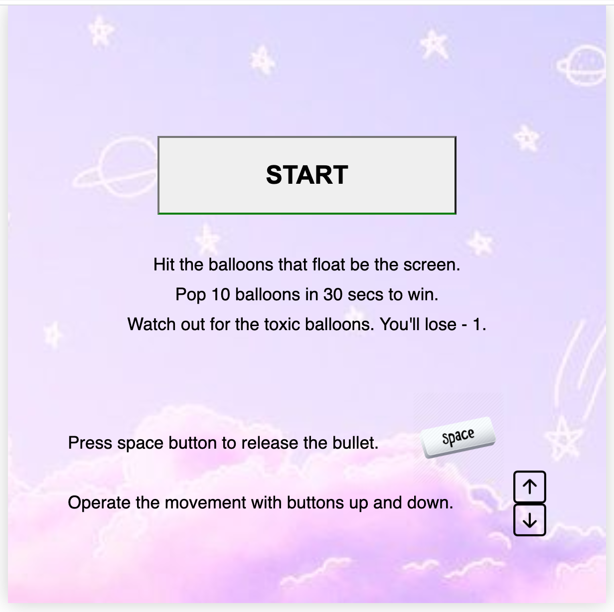
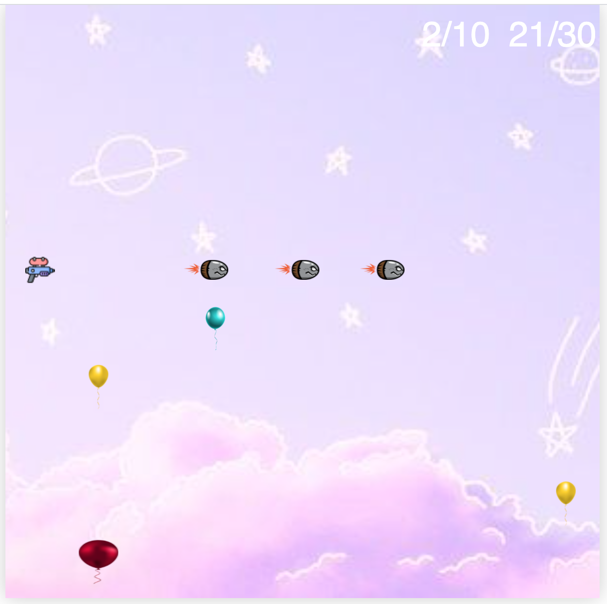
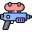

## General Assembly Project 1: Shooter Game
This is a project of a browser game using javascript and CSS.
 
## Timeframe: 7days
 
## Goal
Functional use Vanilla JavaScript to create a game.
 
 
## Technologies
```
HTML, CSS, JavaScript, GIT
```
- version: 1.0.0
- License: MIT
- Author: Puja
## Shooter Game
A single-player game collecting the points shooting the balloons. Users watch out for toxic balloons.
Get 10 points in 30 seconds to win the game.
 

 

 
## Controls
movement: arrows (left, right, up, down),\
shoot: space
## Development process
* Create the game structure of the game board using HTML, CSS, and JavaScript (10 x 10)
Grid 10 x 10 was made with for loop and javascript attribute createElement. The function draws the game board.
 
```
 const width = 10
 const gridCellCount = width * width
```
 
* Set up the initial score and time on click the <i>start</i> button.
 
Function setTimeout starts counting the time and stops if it gains 10 points or after 30 seconds from the start. Return the result and clear the score and time.
 
```
function createGrid() {
   for (let i = 1; i <= gridCellCount; i++) {
     const cell = document.createElement('div')
     cell.classList.add(`box-${i}`)
      
 
     cells.push(cell)
     grid.appendChild(cell)
    
   }
   createShooter(shootPoint)
   baloonsId = setInterval(()=> {
     createBaloon()
   }, 1000)
   timerId = setInterval(()=> {
     time += 1
     updateTime(time)
   }, 1000)
   createResult(score)
 }
```
 
* Create a box for a shooter and organize the functionality.
 
Function <i>panelControl</i> executes the given keyCode of the pressed keyboard button. Users manipulate the position up and down. On clicking the <i>space</i> button it creates the bullet. The destination of the bullet is from left to the right.
 
```
const panelControl = () => {
    
   startBtn.addEventListener('click', function(e){
     frontPage.remove()
     createGrid()
   })
 
   document.addEventListener('keyup', function(e){
    
     if (e.keyCode === 32 || e.keyCode === 13){
       shoot(shootPoint + 1, shootPoint + 9)  
     }
     if (e.keyCode === 38){
       if (shootPoint === 0){
         return shootPoint
       }
       cells[shootPoint].innerText = ''
       shootPoint -= 10
 
       const shooter = document.createElement('div')
       shooter.innerHTML = ''
       shooter.classList.add('shooter')
       cells[shootPoint].appendChild(shooter)
     }
     if (e.keyCode === 40){
       if (shootPoint == 90){
         return shootPoint
       }
       cells[shootPoint].innerText = ''
       shootPoint += 10
       const shooter = document.createElement('div')
       shooter.innerHTML = ''
       shooter.classList.add('shooter')
       cells[shootPoint].appendChild(shooter)
     }    
   })
}
```
 
* Make the balloons appear from the bottom and move to the top of the screen.
 
Function <i>createBalloon</i> appears one balloon per one second with setTimeout as a loop until the end of the game. Balloons change the initial position randomly appearing normal and toxic balloons. Balloons move to the top clearing the box behind them. Once the initial position of the balloon does not change to the left or right until the top of the board.
```
function createBaloon(){
      
   const baloon = document.createElement('div')
 
   const baloonPosition = Math.floor(Math.random() * (99 - 91 + 1)) + 91
   const baloonImages = new Array()
      
   baloonImages[1] = './style/yellow.png'
   baloonImages[2] = './style/blue.png'
   baloonImages[3] = './style/red.png'
   const toxicImages = new Array()
  
   toxicImages[1] = './style/toxic2.png'
   toxicImages[2] = './style/toxic1.png'
 
   const toxic = Math.random() < 0.2
   let createImage
   if (toxic){
     createImage = toxicImages[Math.floor(Math.random() * 2) + 1]
     baloon.className = 'toxic'
     //baloon.style.backgroundImage = baloonImages[1]
     baloon.innerHTML = ``
   } else {
     createImage = baloonImages[Math.floor(Math.random() * 3) + 1]
     baloon.className = 'baloon'
     //baloon.style.backgroundImage = baloonImages[1]
     baloon.innerHTML = ``
   }
 
   cells[baloonPosition].appendChild(baloon)
   moveBaloon(baloonPosition - 10, baloonPosition - 90, toxic, createImage)
 }
```
 
* Check if there is a collision of the balloon with a bullet.
Inside the balloon movement, the if statement checks if the case of collision is true or false. On false function continue the loop. If it returns true then the balloon and bullet disappear. Users lose one point if the balloon was the toxic type or player gets one point if the balloon was the normal type.
 
 
```
if (cells[position].querySelector('.baloon') && cells[position].querySelector('.shot')){      
 score += 1
 updateScore(score, endPoint - 8)
 
 const bulletIndex = cells[endPoint - 8].querySelector('.bullet')
 bulletIndex.remove()
 
 cells[position].querySelector('.baloon').remove()
 cells[position].querySelector('.shot').remove()
 balloonPop()
  return
}
else if (cells[position].querySelector('.toxic') && cells[position].querySelector('.shot')){
    
 
 const bulletIndex = cells[endPoint - 8].querySelector('.bullet')
 bulletIndex.remove()
 
 
 score -= 1
 updateScore(score)
 toxicPop()
 
 cells[position].querySelector('.toxic').remove()
 cells[position].querySelector('.shot').remove()
          
 return
}
```
* Update the score
Function <i>updateScore</i> recognise the collision cases. Then it passes the given parameters into the score.
```
function updateScore(score){
 
   const result = document.querySelector('.score')
   result.innerHTML = `<b style="color: #000; font-size:40.5px">${score}</b>/10`
   setTimeout(() => {
     result.textContent = `${score}/10`
   }, 200)
   if (score === 7){
     endAudio.src = './style/UEFA.mp3'
     endAudio.volume = 0.2
     endAudio.play()
   }
   if (score === 8){
     endAudio.volume = 0.5
   }
   if (score === 10){
     endAudio.volume = 0.8
   }
 
   if (score === 10){
          
     clearInterval(baloonsId)
     clearInterval(timerId)
     grid.textContent = ''
     const victoryResult = document.createElement('button')
     victoryResult.innerHTML = '<b>Victory, well done</b>'
     victoryResult.className = 'victory'
     victoryResult.addEventListener('click', () => location.reload())
     grid.appendChild(victoryResult)
   }
  
 }
 ```
 
 
* Update the time
Function <i>updateTime</i> change time state every second until it collects 30. Then it passes the given parameters into the score.
```
function updateTime(time){
 
   const timer = document.querySelector('.timer')
   timer.innerText = `${time}/30`
 
   if (time === 30){
     endAudio.src = './style/defeat.wav'
     endAudio.volume = 0.2
     endAudio.play()
     clearInterval(baloonsId)
     clearInterval(timerId)
     grid.textContent = ''
     const defaultResult = document.createElement('button')
     defaultResult.innerHTML = '<b>Try again</b>'
     defaultResult.className = 'defeat'
     defaultResult.addEventListener('click', () => location.reload())
     grid.appendChild(defaultResult)
          
   }
 }
```
 
* Return the result
The <i>if statement</i> checks if the score has 10 points of time has 30 then the global function returns the last communication with the won or lost the game and the button to start again.
```
if (score === 10){
 clearInterval(baloonsId)
 clearInterval(timerId)
 grid.textContent = ''
 const victoryResult = document.createElement('button')
 victoryResult.innerHTML = '<b>Victory, well done</b>'
 victoryResult.className = 'victory'
 victoryResult.addEventListener('click', () => location.reload())
 grid.appendChild(victoryResult)
}
```
 
## Challenges
Write the game using JavaScript and CSS with a user interface in the given timeframe of 7 days was a challenge. Also the logical point of making the game functional and getting MVP ready on time. Dealing with the bugs encountered during the process such as movement and collision of the balloons and bullets. The style's challenge was to animate the moving structures of the game and make it smoother.
 
## Wins
Manage to complete the MVP on time.
Resolve the debugging.
 
## Inspiration
This project was inspired by space-invaders games.
